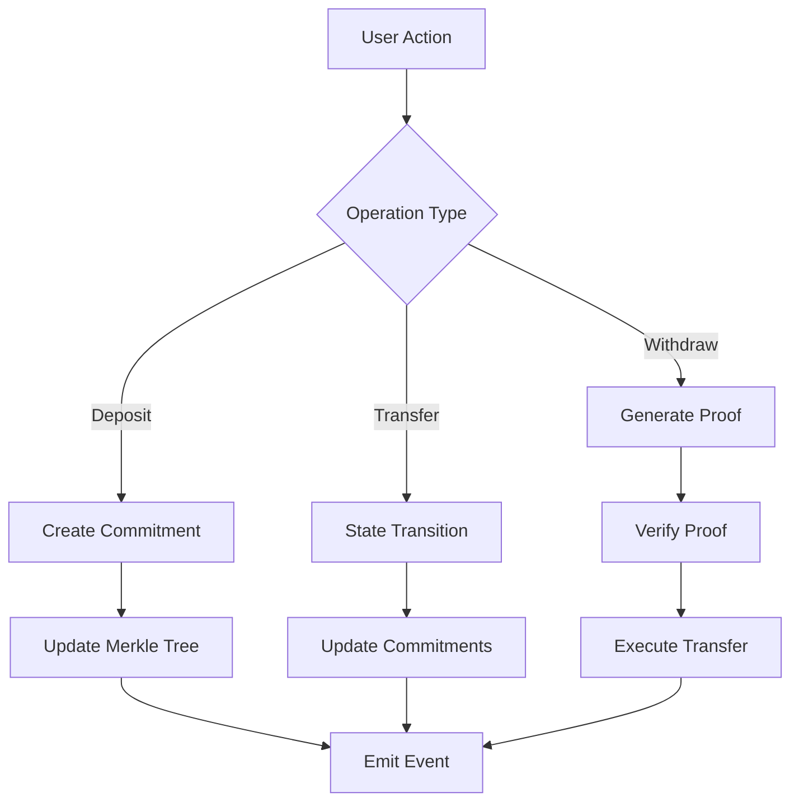

# Zero-Knowledge Lockbox Architecture

## Table of Contents
1. [Overview](#overview)
2. [Core Privacy Principles](#core-privacy-principles)
3. [System Architecture](#system-architecture)
4. [Contract Structure](#contract-structure)
5. [ZK Circuit Design](#zk-circuit-design)
6. [Implementation Phases](#implementation-phases)
7. [Migration Strategy](#migration-strategy)
8. [Gas Optimization](#gas-optimization)
9. [Security Considerations](#security-considerations)
10. [User Experience](#user-experience)

## Overview

The Zero-Knowledge Lockbox system extends the current Lockx NFT-based architecture with complete privacy features while maintaining the soul-bound NFT identity layer. This creates a unique hybrid system where ownership is public but balances and transactions are private.

### Key Innovation
- **Public**: NFT ownership and identity
- **Private**: Balances, transfers, and transaction links
- **Unique**: First system combining soul-bound NFTs with ZK privacy

## Core Privacy Principles

### What Remains Visible
1. **NFT Ownership**: Who owns which Lockbox NFT
2. **Total Deposits**: Sum of all ETH entering the system
3. **Total Withdrawals**: Sum of all ETH leaving the system
4. **Contract Balance**: Total ETH held by contract

### What Becomes Private
1. **Individual Balances**: How much each NFT holds
2. **Transaction Links**: Which NFT sent funds to which recipient
3. **Internal Transfers**: Movement between NFTs
4. **Balance History**: Historical balance changes

## System Architecture

### Three-Layer Design

```
┌─────────────────────────────────────────┐
│         Identity Layer (Public)         │
│    - NFT Ownership (Soul-bound)         │
│    - Metadata URIs                      │
│    - Access Control                     │
└─────────────────────────────────────────┘
                    ↓
┌─────────────────────────────────────────┐
│      Commitment Layer (Private)         │
│    - Balance Commitments                │
│    - State Transitions                  │
│    - Nullifier Management               │
└─────────────────────────────────────────┘
                    ↓
┌─────────────────────────────────────────┐
│       Proof Layer (Zero-Knowledge)      │
│    - SNARK/STARK Verification           │
│    - Merkle Tree Management             │
│    - Circuit Validation                 │
└─────────────────────────────────────────┘
```

### Data Flow



## Contract Structure

### Core Contracts

#### 1. `LockxZK.sol` - Main Contract
```solidity
contract LockxZK is ERC721, IERC5192, ReentrancyGuard, Ownable {
    // Identity Layer
    mapping(uint256 => address) public lockboxOwners;
    mapping(uint256 => string) public metadataURIs;
    
    // Commitment Layer
    mapping(uint256 => bytes32) private balanceCommitments;
    mapping(bytes32 => bool) public nullifiers;
    
    // Merkle Trees
    bytes32 public depositRoot;
    bytes32 public withdrawalRoot;
    IncrementalMerkleTree public stateTree;
    
    // Verifiers
    IDepositVerifier public depositVerifier;
    IWithdrawVerifier public withdrawVerifier;
    ITransferVerifier public transferVerifier;
}
```

#### 2. `Commitments.sol` - Commitment Management
```solidity
library Commitments {
    struct BalanceCommitment {
        bytes32 commitment;
        uint256 nonce;
        uint256 lastUpdated;
    }
    
    struct StateCommitment {
        bytes32 oldRoot;
        bytes32 newRoot;
        bytes32 nullifier;
    }
    
    function createCommitment(
        uint256 balance,
        uint256 nftId,
        bytes32 salt
    ) internal pure returns (bytes32) {
        return keccak256(abi.encodePacked(balance, nftId, salt));
    }
    
    function verifyTransition(
        StateCommitment memory state,
        bytes calldata proof
    ) internal view returns (bool) {
        // Verify state transition validity
    }
}
```

#### 3. `MerkleTree.sol` - Tree Management
```solidity
library IncrementalMerkleTree {
    struct TreeData {
        uint256 depth;
        uint256 nextIndex;
        mapping(uint256 => bytes32) nodes;
        bytes32 root;
    }
    
    function insert(TreeData storage tree, bytes32 leaf) internal {
        // Add leaf and update root
    }
    
    function verify(
        TreeData storage tree,
        bytes32 leaf,
        bytes32[] memory proof
    ) internal view returns (bool) {
        // Verify merkle proof
    }
}
```

### Interface Design

#### Deposit Operations
```solidity
interface ILockxZKDeposits {
    // Create NFT with private balance
    function createPrivateLockbox(
        bytes32 initialCommitment,
        bytes calldata proof
    ) external payable returns (uint256);
    
    // Add to existing NFT (target hidden)
    function depositPrivate(
        bytes32[] calldata decoyCommitments,
        bytes32 depositCommitment,
        bytes calldata proof
    ) external payable;
    
    // Batch deposit with privacy
    function batchDepositPrivate(
        bytes32[] calldata commitments,
        uint256[] calldata amounts,
        bytes calldata proof
    ) external payable;
}
```

#### Withdrawal Operations
```solidity
interface ILockxZKWithdrawals {
    // Queue withdrawal (hides recipient)
    function queueWithdrawal(
        bytes32 withdrawalCommitment,
        bytes calldata authProof
    ) external;
    
    // Claim withdrawal (breaks link)
    function claimWithdrawal(
        address recipient,
        uint256 amount,
        bytes32 nullifier,
        bytes calldata zkProof
    ) external;
    
    // Emergency withdrawal (requires ownership)
    function emergencyWithdraw(
        uint256 nftId,
        bytes calldata ownershipProof
    ) external;
}
```

#### Internal Operations
```solidity
interface ILockxZKInternal {
    // Transfer between owned NFTs
    function privateTransfer(
        uint256[] calldata nftIds,
        bytes32 newStateRoot,
        bytes calldata proof
    ) external;
    
    // Merge multiple NFTs
    function mergeBalances(
        uint256[] calldata sourceIds,
        uint256 targetId,
        bytes calldata proof
    ) external;
    
    // Split NFT balance
    function splitBalance(
        uint256 sourceId,
        uint256[] calldata targetIds,
        bytes32[] calldata newCommitments,
        bytes calldata proof
    ) external;
}
```

## ZK Circuit Design

### 1. Deposit Circuit
```javascript
// circuits/deposit.circom
pragma circom 2.0.0;

template DepositCircuit() {
    // Public inputs
    signal input depositAmount;
    signal input merkleRoot;
    signal input newCommitment;
    
    // Private inputs
    signal input nftId;
    signal input currentBalance;
    signal input salt;
    signal input merkleProof[20];
    
    // Constraints
    // 1. Verify merkle inclusion
    component merkleVerifier = MerkleVerifier(20);
    merkleVerifier.leaf <== Poseidon([nftId, currentBalance, salt]);
    merkleVerifier.root <== merkleRoot;
    merkleVerifier.proof <== merkleProof;
    
    // 2. Calculate new balance
    signal newBalance;
    newBalance <== currentBalance + depositAmount;
    
    // 3. Create new commitment
    component commitmentHasher = Poseidon(3);
    commitmentHasher.inputs[0] <== nftId;
    commitmentHasher.inputs[1] <== newBalance;
    commitmentHasher.inputs[2] <== salt;
    commitmentHasher.out === newCommitment;
}
```

### 2. Withdrawal Circuit
```javascript
// circuits/withdraw.circom
pragma circom 2.0.0;

template WithdrawCircuit() {
    // Public inputs
    signal input withdrawalRoot;
    signal input nullifierHash;
    signal input recipient;
    signal input amount;
    
    // Private inputs
    signal input nftId;
    signal input balance;
    signal input salt;
    signal input nullifier;
    signal input merkleProof[20];
    
    // Constraints
    // 1. Verify balance >= amount
    component balanceCheck = GreaterEqThan(252);
    balanceCheck.in[0] <== balance;
    balanceCheck.in[1] <== amount;
    balanceCheck.out === 1;
    
    // 2. Verify nullifier hash
    component nullifierHasher = Poseidon(1);
    nullifierHasher.inputs[0] <== nullifier;
    nullifierHasher.out === nullifierHash;
    
    // 3. Verify merkle proof
    component merkleVerifier = MerkleVerifier(20);
    merkleVerifier.leaf <== Poseidon([nftId, balance, salt, nullifier]);
    merkleVerifier.root <== withdrawalRoot;
    merkleVerifier.proof <== merkleProof;
    
    // 4. Verify recipient
    signal recipientHash;
    recipientHash <== Poseidon([recipient, amount, nullifier]);
}
```

### 3. Transfer Circuit
```javascript
// circuits/transfer.circom
pragma circom 2.0.0;

template TransferCircuit() {
    // Public inputs
    signal input oldStateRoot;
    signal input newStateRoot;
    signal input nftIds[2];
    
    // Private inputs
    signal input fromBalance;
    signal input toBalance;
    signal input transferAmount;
    signal input salt;
    
    // Constraints
    // 1. Verify sufficient balance
    component balanceCheck = GreaterEqThan(252);
    balanceCheck.in[0] <== fromBalance;
    balanceCheck.in[1] <== transferAmount;
    balanceCheck.out === 1;
    
    // 2. Calculate new balances
    signal newFromBalance;
    signal newToBalance;
    newFromBalance <== fromBalance - transferAmount;
    newToBalance <== toBalance + transferAmount;
    
    // 3. Verify state transition
    component oldState = Poseidon(4);
    oldState.inputs[0] <== nftIds[0];
    oldState.inputs[1] <== fromBalance;
    oldState.inputs[2] <== nftIds[1];
    oldState.inputs[3] <== toBalance;
    oldState.out === oldStateRoot;
    
    component newState = Poseidon(4);
    newState.inputs[0] <== nftIds[0];
    newState.inputs[1] <== newFromBalance;
    newState.inputs[2] <== nftIds[1];
    newState.inputs[3] <== newToBalance;
    newState.out === newStateRoot;
}
```

## Implementation Phases

### Phase 1: Foundation (Weeks 1-2)
- [ ] Set up Circom development environment
- [ ] Implement basic commitment structure
- [ ] Create merkle tree library
- [ ] Deploy test verifier contracts
- [ ] Unit tests for commitment generation

### Phase 2: Core Privacy (Weeks 3-4)
- [ ] Implement deposit circuits
- [ ] Create withdrawal queue system
- [ ] Build nullifier management
- [ ] Integrate proof verification
- [ ] Test privacy guarantees

### Phase 3: Advanced Features (Weeks 5-6)
- [ ] Internal transfer circuits
- [ ] Batch operation support
- [ ] Emergency withdrawal mechanism
- [ ] Gas optimization pass
- [ ] Security audit preparation

### Phase 4: Integration (Weeks 7-8)
- [ ] Client SDK development
- [ ] Proof generation service
- [ ] Migration tools
- [ ] Documentation
- [ ] Mainnet deployment preparation

## Migration Strategy

### For Existing Lockboxes

#### Option 1: Opt-in Migration
```solidity
function migrateToPrivate(
    uint256 nftId,
    bytes32 newCommitment,
    bytes calldata proof
) external {
    require(ownerOf(nftId) == msg.sender);
    uint256 balance = publicBalances[nftId];
    
    // Verify commitment matches balance
    require(verifyMigrationProof(proof, balance, newCommitment));
    
    // Transition to private
    delete publicBalances[nftId];
    privateCommitments[nftId] = newCommitment;
    
    emit MigratedToPrivate(nftId);
}
```

#### Option 2: Dual Mode
```solidity
struct Lockbox {
    uint256 publicBalance;   // Legacy transparent
    bytes32 privateBalance;  // New private
    bool isPrivate;         // Mode flag
}
```

### Backward Compatibility
- Maintain existing deposit/withdraw interfaces
- Add privacy parameter to functions
- Default to transparent for unmodified clients
- Gradual transition period

## Gas Optimization

### Storage Optimization
```solidity
// Pack struct data
struct PackedLockbox {
    uint128 nonce;        // Reduced from uint256
    uint64 lastUpdated;   // Timestamp
    uint64 flags;         // Feature flags
    bytes32 commitment;   // Main data
}

// Use mappings instead of arrays where possible
mapping(uint256 => bytes32) commitments;  // Not array
```

### Batch Operations
```solidity
// Batch proof verification
function batchVerify(
    bytes32[] calldata commitments,
    bytes calldata aggregatedProof
) external {
    // Single proof for multiple operations
    // Saves ~50% gas on verification
}
```

### Circuit Optimization
- Use Poseidon hash instead of SHA256 (cheaper in circuits)
- Minimize public inputs (expensive to verify)
- Optimize merkle tree depth (20 levels = 1M leaves)
- Use lookup tables for common operations

### Gas Estimates
| Operation | Current System | ZK System | Increase |
|-----------|---------------|-----------|----------|
| Create NFT | 150k | 250k | 1.67x |
| Deposit | 50k | 200k | 4x |
| Withdraw | 60k | 300k | 5x |
| Transfer | 45k | 250k | 5.5x |

## Security Considerations

### Circuit Security
1. **Trusted Setup**: Use Powers of Tau ceremony
2. **Circuit Audit**: Formal verification required
3. **Constraint System**: Ensure soundness
4. **Side Channels**: Prevent timing attacks

### Smart Contract Security
1. **Reentrancy**: All functions nonReentrant
2. **Front-running**: Use commit-reveal where needed
3. **Griefing**: Rate limiting on operations
4. **Emergency**: Pause mechanism for circuit bugs

### Cryptographic Security
```solidity
// Use secure randomness
function generateSalt() private view returns (bytes32) {
    return keccak256(
        abi.encodePacked(
            block.timestamp,
            block.difficulty,
            msg.sender,
            nonce++
        )
    );
}

// Prevent nullifier reuse
modifier uniqueNullifier(bytes32 nullifier) {
    require(!nullifiers[nullifier], "Nullifier used");
    nullifiers[nullifier] = true;
    _;
}
```

## User Experience

### Client Requirements

#### Wallet Integration
```javascript
// Client-side proof generation
class LockxZKClient {
    constructor(provider, circuits) {
        this.provider = provider;
        this.circuits = circuits;
        this.storage = new SecureStorage();
    }
    
    async createCommitment(nftId, balance) {
        const salt = randomBytes(32);
        const commitment = poseidon([nftId, balance, salt]);
        
        // Store securely
        await this.storage.save({
            nftId,
            balance,
            salt,
            commitment
        });
        
        return commitment;
    }
    
    async generateDepositProof(nftId, amount) {
        const data = await this.storage.load(nftId);
        const input = {
            // Public
            depositAmount: amount,
            newCommitment: data.commitment,
            
            // Private
            nftId: nftId,
            currentBalance: data.balance,
            salt: data.salt
        };
        
        return await this.circuits.deposit.prove(input);
    }
}
```

#### Backup & Recovery
```javascript
// Encrypted backup of private data
class LockxBackup {
    static async export(password) {
        const data = await storage.getAll();
        const encrypted = await encrypt(data, password);
        return {
            version: "1.0",
            timestamp: Date.now(),
            data: encrypted
        };
    }
    
    static async import(backup, password) {
        const decrypted = await decrypt(backup.data, password);
        await storage.restore(decrypted);
    }
}
```

### UI/UX Considerations

1. **Progressive Disclosure**: Don't overwhelm users with ZK concepts
2. **Clear Status**: Show when operations are private vs public
3. **Backup Prompts**: Regular reminders to backup commitment data
4. **Gas Warnings**: Inform users of higher gas costs
5. **Proof Generation**: Show progress for proof computation

### Error Handling
```solidity
error InsufficientBalance(uint256 requested, bytes32 commitment);
error InvalidProof(bytes32 expectedRoot, bytes32 providedRoot);
error NullifierAlreadyUsed(bytes32 nullifier);
error CommitmentNotFound(bytes32 commitment);
error ProofGenerationFailed(string reason);
```

## Appendix

### Dependencies
- Circom 2.0+ for circuit development
- SnarkJS for proof generation
- Hardhat for contract development
- OpenZeppelin for standard contracts
- Poseidon hash implementation

### Testing Strategy
1. Unit tests for each circuit
2. Integration tests for contract interactions
3. Privacy tests to verify information hiding
4. Gas consumption benchmarks
5. Stress tests with many concurrent operations

### Audit Checklist
- [ ] Circuit constraints correctness
- [ ] Trusted setup security
- [ ] Smart contract vulnerabilities
- [ ] Privacy guarantees validation
- [ ] Gas optimization review
- [ ] Emergency mechanism testing

### Resources
- [Circom Documentation](https://docs.circom.io/)
- [SnarkJS Guide](https://github.com/iden3/snarkjs)
- [Poseidon Hash](https://www.poseidon-hash.info/)
- [ZK-SNARK Security](https://github.com/matter-labs/awesome-zero-knowledge-proofs)

---

*This architecture document is a living document and will be updated as the implementation progresses.*