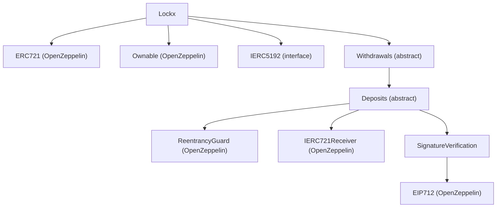

## Lockx smart contracts technical specification (v2)

This document provides a low‑level technical specification of the four core contracts under `contracts/`, ordered by runtime entrypoints: `Lockx.sol`, `Withdrawals.sol`, `Deposits.sol`, and `SignatureVerification.sol`. It details storage layout, validation rules, function behaviors, invariants, and security properties, with inline code excerpts from the repository.

### Conventions

- "Lockbox" refers to an ERC‑721 token minted by `Lockx` which scopes balances and authorization.
- All external state‑changing entrypoints are guarded by non‑reentrancy.
- EIP‑712 is used to authorize sensitive operations and bind calldata.
- Headings use sentence case.

---

## Lockx.sol

### Purpose

Core ERC‑721 soulbound contract that mints lockboxes and wraps deposit flows. Exposes metadata management and key rotation (via inherited EIP‑712). Inherits `Withdrawals` → `Deposits` → `SignatureVerification`.

### Storage and events

- `uint256 _nextId`: next token id to mint.
- Metadata: `_defaultMetadataURI`, `_tokenMetadataURIs[tokenId]`.
- Events: `TokenMetadataURISet`, `Minted`, `LockboxBurned`, `KeyRotated` and ERC‑5192 `Locked`.

### Errors (local to Lockx)

- `ZeroTokenAddress`, `ArrayLengthMismatch`, `EthValueMismatch`, `DefaultURIAlreadySet`, `NoURI`, `TransfersDisabled`, `UseDepositETH`, `FallbackNotAllowed`, `SelfMintOnly`, `LockboxNotEmpty`.
- Shared errors from inherited modules are documented in their sections (e.g., `ZeroKey`, `NotOwner`).

### Minting with ETH

Validates `to == msg.sender`, non‑zero key, and positive ETH; mints, initializes the EIP‑712 key/nonce, credits ETH, emits `Locked` and `Minted`.

```83:103:contracts/Lockx.sol
function createLockboxWithETH(
    address to,
    address lockboxPublicKey,
    bytes32 referenceId
) external payable nonReentrant {
    // 1) Checks
    if (to != msg.sender) revert SelfMintOnly();
    if (lockboxPublicKey == address(0)) revert ZeroKey();
    if (msg.value == 0) revert ZeroAmount();

    // 2) Effects
    uint256 tokenId = _nextId++;
    initialize(tokenId, lockboxPublicKey);
    _mint(to, tokenId);

    // 3) Interactions
    _depositETH(tokenId, msg.value);

    emit Locked(tokenId);
    emit Minted(tokenId, referenceId);
}
```

### Minting with ERC‑20

Validates `to == msg.sender`, non‑zero key/token, positive amount; mints, initializes, deposits ERC‑20 via internal helper.

```118:141:contracts/Lockx.sol
function createLockboxWithERC20(
    address to,
    address lockboxPublicKey,
    address tokenAddress,
    uint256 amount,
    bytes32 referenceId
) external nonReentrant {
    // 1) Checks
    if (to != msg.sender) revert SelfMintOnly();
    if (lockboxPublicKey == address(0)) revert ZeroKey();
    if (tokenAddress == address(0)) revert ZeroTokenAddress();
    if (amount == 0) revert ZeroAmount();

    // 2) Effects
    uint256 tokenId = _nextId++;
    initialize(tokenId, lockboxPublicKey);
    _mint(to, tokenId);
    
    // 3) Interactions
    _depositERC20(tokenId, tokenAddress, amount);

    emit Locked(tokenId);
    emit Minted(tokenId, referenceId);
}
```

### Minting with ERC‑721

Validates `to == msg.sender`, non‑zero key and NFT contract; mints, initializes, deposits NFT.

```154:176:contracts/Lockx.sol
function createLockboxWithERC721(
    address to,
    address lockboxPublicKey,
    address nftContract,
    uint256 externalNftTokenId,
    bytes32 referenceId
) external nonReentrant {
    // 1) Checks
    if (to != msg.sender) revert SelfMintOnly();
    if (lockboxPublicKey == address(0)) revert ZeroKey();
    if (nftContract == address(0)) revert ZeroTokenAddress();

    // 2) Effects
    uint256 tokenId = _nextId++;
    initialize(tokenId, lockboxPublicKey);
    _mint(to, tokenId);
    
    // 3) Interactions
    _depositERC721(tokenId, nftContract, externalNftTokenId);

    emit Locked(tokenId);
    emit Minted(tokenId, referenceId);
}
```

### Batch minting with mixed deposits

Accepts ETH, multiple ERC‑20s and ERC‑721s in one call; validates array lengths and ETH match; mints, initializes, then calls `_batchDeposit`.

```195:224:contracts/Lockx.sol
function createLockboxWithBatch(
    address to,
    address lockboxPublicKey,
    uint256 amountETH,
    address[] calldata tokenAddresses,
    uint256[] calldata tokenAmounts,
    address[] calldata nftContracts,
    uint256[] calldata nftTokenIds,
    bytes32 referenceId
) external payable nonReentrant {
    // 1) Checks
    if (to != msg.sender) revert SelfMintOnly();
    if (lockboxPublicKey == address(0)) revert ZeroKey();
    if (
        tokenAddresses.length != tokenAmounts.length ||
        nftContracts.length != nftTokenIds.length
    ) revert ArrayLengthMismatch();
    if (msg.value != amountETH) revert EthValueMismatch();

    // 2) Effects
    uint256 tokenId = _nextId++;
    initialize(tokenId, lockboxPublicKey);
    _mint(to, tokenId);
    
    // 3) Interactions
    _batchDeposit(tokenId, amountETH, tokenAddresses, tokenAmounts, nftContracts, nftTokenIds);

    emit Locked(tokenId);
    emit Minted(tokenId, referenceId);
}
```

### Metadata management and soulbound behavior

- `setDefaultMetadataURI(string)` owner‑only, single set.
- `setTokenMetadataURI(tokenId, …)` is EIP‑712 authorized by the current lockbox key.
- `_update` prevents transfers and clears per‑token metadata on burn.

```300:309:contracts/Lockx.sol
function tokenURI(uint256 tokenId) public view override(ERC721) returns (string memory) {
    if (_ownerOf(tokenId) == address(0)) revert NonexistentToken();
    string memory custom = _tokenMetadataURIs[tokenId];
    if (bytes(custom).length > 0) return custom;
    if (bytes(_defaultMetadataURI).length > 0) {
        return string(abi.encodePacked(_defaultMetadataURI, Strings.toString(tokenId)));
    }
    revert NoURI();
}
```

---

## Withdrawals.sol

### Purpose

Implements signature‑gated withdrawals (single and batch), the swap primitive with layered safety, and a full‑contents view. Inherits `Deposits`.

### Constants, events, errors

- `TREASURY_LOCKBOX_ID = 0`, `SWAP_FEE_BP = 20` (0.2%).
- Events: `Withdrawn`, `SwapExecuted`.
- Errors: `NoETHBalance`, `InsufficientTokenBalance`, `NFTNotFound`, `EthTransferFailed`, `SignatureExpired`, `SwapCallFailed`, `InvalidSwap`, `SlippageExceeded`, `RouterOverspent`, `DuplicateEntry`, `InvalidRecipient`, `UnauthorizedRouter`.

### Recipient validation on withdrawals

All ETH/ERC‑20 withdrawals and `batchWithdraw` reject `recipient == address(0)` and `recipient == address(this)` to avoid trapping funds in the contract.

```268:286:contracts/Withdrawals.sol
function batchWithdraw(
    uint256 tokenId,
    bytes32 messageHash,
    bytes memory signature,
    uint256 amountETH,
    address[] calldata tokenAddresses,
    uint256[] calldata tokenAmounts,
    address[] calldata nftContracts,
    uint256[] calldata nftTokenIds,
    address recipient,
    bytes32 referenceId,
    uint256 signatureExpiry
) external nonReentrant {
    _requireOwnsLockbox(tokenId);
    if (recipient == address(0) || recipient == address(this)) revert InvalidRecipient();
    if (block.timestamp > signatureExpiry) revert SignatureExpired();
    if (
        tokenAddresses.length != tokenAmounts.length ||
        nftContracts.length != nftTokenIds.length
    ) revert MismatchedInputs();
    // … continued below …
}
```

### Swap security model (arbitrary call hardening)

Before executing the external call, the contract enforces:

- **Target checks**: `target != 0` and `target != address(this)`.
- **Held‑asset guard**: reject if `target` is any ERC‑20/NFT contract the system currently holds (`_heldErc20Count[target] > 0 || _heldNftCount[target] > 0`).
- **Selector blocklist**: extract `bytes4(data[:4])` and reject `approve`, `transfer`, `transferFrom`, `setApprovalForAll`, and all ERC‑721/1155 `safeTransferFrom` signatures.

```423:442:contracts/Withdrawals.sol
// Prevent calling any contract we hold assets in
if (_heldErc20Count[target] > 0 || _heldNftCount[target] > 0) {
    revert UnauthorizedRouter(); // Cannot call contracts where we hold assets
}

// Additional validation: block dangerous selectors as extra protection
if (data.length >= 4) {
    // Use high-level slicing for selector extraction to avoid any calldata offset pitfalls
    bytes4 selector = bytes4(data[:4]);
    // Block ERC20/721/1155 functions that could drain funds or set approvals
    if (selector == bytes4(keccak256("transfer(address,uint256)")) ||
        selector == bytes4(keccak256("approve(address,uint256)")) ||  // ERC20 & ERC721
        selector == bytes4(keccak256("transferFrom(address,address,uint256)")) ||
        selector == bytes4(keccak256("setApprovalForAll(address,bool)")) || // ERC721 & ERC1155
        selector == bytes4(keccak256("safeTransferFrom(address,address,uint256)")) || // ERC721
        selector == bytes4(keccak256("safeTransferFrom(address,address,uint256,bytes)")) || // ERC721
        selector == bytes4(keccak256("safeTransferFrom(address,address,uint256,uint256,bytes)"))) { // ERC1155
        revert UnauthorizedRouter();
    }
}
```

### Swap execution and per‑call approvals

- Signature binds `tokenId, tokenIn, tokenOut, amountIn, minAmountOut, target, keccak256(data), referenceId, msg.sender, signatureExpiry, recipient`.
- Pre/post balance deltas compute `actualAmountIn` and `amountOut` and enforce `actualAmountIn <= amountIn` and `amountOut - fee >= minAmountOut`.
- Approvals are set to exactly `amountIn` for the duration of the call and reset to zero afterward.

```489:507:contracts/Withdrawals.sol
// 4) Execute swap with USDT-safe approval pattern
if (tokenIn != address(0)) {
    // Only reset to 0 if there's an existing approval to save gas
    uint256 currentAllowance = IERC20(tokenIn).allowance(address(this), target);
    if (currentAllowance != 0) {
        IERC20(tokenIn).forceApprove(target, 0);     // Reset first for USDT
    }
    IERC20(tokenIn).forceApprove(target, amountIn);
}
        
(bool success,) = target.call{value: tokenIn == address(0) ? amountIn : 0}(data);
        
// Clean up approval
if (tokenIn != address(0)) {
    IERC20(tokenIn).forceApprove(target, 0);
}
if (!success) revert SwapCallFailed();
```

### Fee crediting and outputs

- Fee: `fee = amountOut * SWAP_FEE_BP / 10000`. Fee is credited to `TREASURY_LOCKBOX_ID` (id 0). Remainder is either sent to `recipient` or credited to the user’s lockbox accounting for `tokenOut` (registering the token if new).
- Deployment must ensure token id 0 semantics match treasury ownership operationally.

---

## Deposits.sol

### Purpose

Implements ETH/ERC‑20/ERC‑721 deposit flows and bookkeeping. Also tracks global held‑asset registries used by swap hardening.

### Storage layout

- ETH: `_ethBalances[tokenId]`.
- ERC‑20s: `_erc20Balances[tokenId][token]`, address list `_erc20TokenAddresses[tokenId]`, and `_erc20Index[tokenId][token]` for O(1) removal.
- ERC‑721s: `nftBalances{nftContract, nftTokenId}`, keys array `_nftKeys[tokenId]`, mapping `_lockboxNftData[tokenId][key]`, and `_nftIndex[tokenId][key]` for O(1) removal.
- Global registries: `_heldErc20Count[token]`, `_heldNftCount[nftContract]`.

### Gated NFT receiver

`onERC721Received` only accepts transfers during controlled deposits. Transient state records the expected `nftContract` and `nftTokenId`; unsolicited transfers revert.

```73:86:contracts/Deposits.sol
function onERC721Received(
    address,
    address,
    uint256 tokenId,
    bytes calldata
) public view override returns (bytes4) {
    // Only accept NFTs during controlled deposits via depositERC721()
    if (!_nftAccepting || 
        msg.sender != _expectedNftContract || 
        tokenId != _expectedNftTokenId) {
        revert("Direct NFT transfers not allowed. Use depositERC721()");
    }
    return this.onERC721Received.selector;
}
```

### ERC‑20 deposits (fee‑on‑transfer compatible)

- Pull tokens first; compute received via balance delta; register token on first deposit for the lockbox; increment `_heldErc20Count` if newly held by that lockbox.

```211:230:contracts/Deposits.sol
function _depositERC20(uint256 tokenId, address token, uint256 amount) internal {
    IERC20 t = IERC20(token);

    // Interaction: pull tokens first
    uint256 before = t.balanceOf(address(this));
    t.safeTransferFrom(msg.sender, address(this), amount);
    uint256 received = t.balanceOf(address(this)) - before;
    if (received == 0) revert ZeroAmount();

    // Register new token with index
    bool isNewToken = (_erc20Index[tokenId][token] == 0);
    if (isNewToken) {
        _erc20Index[tokenId][token] = _erc20TokenAddresses[tokenId].length + 1;
        _erc20TokenAddresses[tokenId].push(token);
        // Increment global count when lockbox first holds this token
        _heldErc20Count[token]++;
    }

    _erc20Balances[tokenId][token] += received;
}
```

### ERC‑721 deposits (transient acceptance)

- Registers the NFT key; increments `_heldNftCount[nftContract]` when the first NFT from that contract is added to the lockbox; sets transient accept state around `safeTransferFrom`.

```261:271:contracts/Deposits.sol
// Set expected NFT state for onERC721Received validation
_expectedNftContract = nftContract;
_expectedNftTokenId = nftTokenId;
_nftAccepting = true;
        
IERC721(nftContract).safeTransferFrom(msg.sender, address(this), nftTokenId);
        
// Clear the expected state
_nftAccepting = false;
_expectedNftContract = address(0);
_expectedNftTokenId = 0;
```

### Batch deposits

Accepts ETH, multiple ERC‑20s and ERC‑721s; validates ETH amount and array lengths; loops over arrays using cached lengths and unchecked increments for gas efficiency.

```275:302:contracts/Deposits.sol
function _batchDeposit(
    uint256 tokenId,
    uint256 amountETH,
    address[] calldata tokenAddresses,
    uint256[] calldata tokenAmounts,
    address[] calldata nftContracts,
    uint256[] calldata nftTokenIds
) internal {
    if (amountETH > 0) _ethBalances[tokenId] += amountETH;

    uint256 tLen = tokenAddresses.length;
    for (uint256 i; i < tLen; ) {
        _depositERC20(tokenId, tokenAddresses[i], tokenAmounts[i]);
        unchecked { ++i; }
    }

    uint256 nLen = nftContracts.length;
    for (uint256 j; j < nLen; ) {
        _depositERC721(tokenId, nftContracts[j], nftTokenIds[j]);
        unchecked { ++j; }
    }
}
```

### Removal utilities

- `_removeERC20Token` and `_removeNFTKey` perform O(1) swap‑and‑pop removal and maintain indices; `_removeNFTKey` decrements `_heldNftCount` when the last NFT from a contract leaves the lockbox.

---

## SignatureVerification.sol

### Purpose

Provides EIP‑712 domain, per‑token authorization state, and signature verification. Also exposes token‑owner gated views.

### Storage and types

- `enum OperationType { ROTATE_KEY, WITHDRAW_ETH, WITHDRAW_ERC20, WITHDRAW_NFT, BURN_LOCKBOX, SET_TOKEN_URI, BATCH_WITHDRAW, SWAP_ASSETS }`.
- `struct TokenAuth { address activeLockboxPublicKey; uint96 nonce; }`.
- `_tokenAuth[tokenId]` mapping; immutable `_erc721` pointer.
- Domain: name `"Lockx"`, version `"4"`.

### Initialization and verification

- `initialize(tokenId, lockboxPublicKey)`: sets public key and nonce=1; revert on re‑init.
- `verifySignature(...)`: binds `tokenId, nonce, opType, keccak256(data)`; checks signer matches active key; increments nonce; updates key for `ROTATE_KEY` when non‑zero.

```115:148:contracts/SignatureVerification.sol
function verifySignature(
    uint256 tokenId,
    bytes32 messageHash,
    bytes memory signature,
    address newLockboxPublicKey,
    OperationType opType,
    bytes memory data
) internal {
    TokenAuth storage tokenAuth = _tokenAuth[tokenId];

    // Compute the hash of the operation data.
    bytes32 dataHash = keccak256(data);
    bytes32 structHash = keccak256(
        abi.encode(OPERATION_TYPEHASH, tokenId, tokenAuth.nonce, uint8(opType), dataHash)
    );
    bytes32 expectedHash = _hashTypedDataV4(structHash);

    if (messageHash != expectedHash) {
        revert InvalidMessageHash();
    }

    address signer = expectedHash.recover(signature);
    if (signer != tokenAuth.activeLockboxPublicKey) {
        revert InvalidSignature();
    }

    // Increment nonce after successful verification.
    tokenAuth.nonce++;

    // If rotating the key, update the active Lockbox public key.
    if (opType == OperationType.ROTATE_KEY && newLockboxPublicKey != address(0)) {
        tokenAuth.activeLockboxPublicKey = newLockboxPublicKey;
    }
}
```

---

## Views and interfaces

- `getFullLockbox(tokenId)` returns ETH amount, enumerated ERC‑20 balances (by tracked token list), and enumerated NFTs (by stored keys).
- ERC‑5192 soulbound interface: `locked(tokenId) == true` for existing tokens.
- `supportsInterface` includes `IERC5192` and `IERC721Receiver`.

---

## Inheritance architecture



---

## Security properties and assumptions

- Authorization: sensitive operations require both ERC‑721 ownership and a valid EIP‑712 signature from the current lockbox key; nonces prevent replay.
- Swap hardening: target blocklist for held asset contracts; selector blocklist for approvals/transfers; per‑call approvals; pre/post balance enforcement; signature binds `target` and `keccak256(data)`.
- Receiver hardening: unsolicited NFTs revert; only controlled deposits succeed.
- Treasury: `TREASURY_LOCKBOX_ID` is `0`; deployments must ensure token id 0 is owned by the intended treasury to avoid fee miscrediting.


